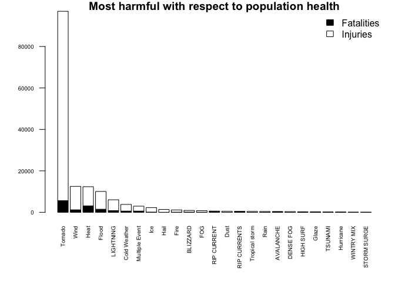

NOAA Storm Data Analysis Report
================

# Sypnosis

Storms and other severe weather events can cause both public health and
economic problems for communities and municipalities. Many severe events
can result in fatalities, injuries, and property damage, and preventing
such outcomes to the extent possible is a key concern.

This project involves exploring the U.S. National Oceanic and
Atmospheric Administration’s (NOAA) storm database in order to answer
two questions. This database tracks characteristics of major storms and
weather events in the United States, including when and where they
occur, as well as estimates of any fatalities, injuries, and property
damage.

#### Questions

1)  which types of events (as indicated in the EVTYPE variable) are most
    harmful with respect to population health?
2)  Across the United States, which types of events have the greatest
    economic consequences?

# Data Processing

#### Loading and preprocessing the data

Read the original files

``` r
data <- read.csv("StormData.csv.bz2")
```

#### Grouping event tpye (EVTYPE)

``` r
data$EVTYPE <- as.character(data$EVTYPE)
data$EVTYPE[grepl("/|&|and", data$EVTYPE,ignore.case = TRUE)] <- "Multiple Event"
data$EVTYPE[grepl("volc", data$EVTYPE,ignore.case = TRUE)] <- "Volcano"
data$EVTYPE[grepl("wind|wnd", data$EVTYPE,ignore.case = TRUE)] <- "Wind"
data$EVTYPE[grepl("funnel|tornado", data$EVTYPE,ignore.case = TRUE)] <- "Tornado"
data$EVTYPE[grepl("glaze", data$EVTYPE,ignore.case = TRUE)] <- "Glaze"
data$EVTYPE[grepl("hail", data$EVTYPE,ignore.case = TRUE)] <- "Hail"
data$EVTYPE[grepl("dust", data$EVTYPE,ignore.case = TRUE)]  <- "Dust"
data$EVTYPE[grepl("flood", data$EVTYPE,ignore.case = TRUE)] <- "Flood"
data$EVTYPE[grepl("ic(e|y)", data$EVTYPE,ignore.case = TRUE)] <- "Ice"
data$EVTYPE[grepl("fire|smoke", data$EVTYPE,ignore.case = TRUE)] <- "Fire"
data$EVTYPE[grepl("thunder", data$EVTYPE,ignore.case = TRUE)] <- "Thunder storm"
data$EVTYPE[grepl("slide|eros", data$EVTYPE,ignore.case = TRUE)] <- "Erosion"
data$EVTYPE[grepl("rain", data$EVTYPE,ignore.case = TRUE)] <- "Rain"
data$EVTYPE[grepl("freez|cold|snow|chill|winter", data$EVTYPE,ignore.case = TRUE)] <- "Cold Weather"
data$EVTYPE[grepl("TROPICAL.STORM", data$EVTYPE,ignore.case = TRUE)] <- "Tropical storm"
data$EVTYPE[grepl("heat", data$EVTYPE,ignore.case = TRUE)] <- "Heat"
data$EVTYPE[grepl("(hurri|opal)", data$EVTYPE,ignore.case = TRUE)] <- "Hurricane"
```

#### Seperate effect tpye (Health and Property)

``` r
health <- data[,(c(8,23:24))]
property<-data[,c(8,25:28)]
head(property)
```

    ##    EVTYPE PROPDMG PROPDMGEXP CROPDMG CROPDMGEXP
    ## 1 Tornado    25.0          K       0           
    ## 2 Tornado     2.5          K       0           
    ## 3 Tornado    25.0          K       0           
    ## 4 Tornado     2.5          K       0           
    ## 5 Tornado     2.5          K       0           
    ## 6 Tornado     2.5          K       0

``` r
head(health)
```

    ##    EVTYPE FATALITIES INJURIES
    ## 1 Tornado          0       15
    ## 2 Tornado          0        0
    ## 3 Tornado          0        2
    ## 4 Tornado          0        2
    ## 5 Tornado          0        2
    ## 6 Tornado          0        6

#### Magnitude Values

These columns identify the magnitude that the damage shoohuld be
multiplied against to accurately assess damage amount.

Replace the empty fields with the magnitude O

``` r
table(property$PROPDMGEXP)
```

    ## 
    ##             -      ?      +      0      1      2      3      4      5 
    ## 465934      1      8      5    216     25     13      4      4     28 
    ##      6      7      8      B      h      H      K      m      M 
    ##      4      5      1     40      1      6 424665      7  11330

``` r
table(property$CROPDMGEXP)
```

    ## 
    ##             ?      0      2      B      k      K      m      M 
    ## 618413      7     19      1      9     21 281832      1   1994

``` r
property$PROPDMGEXP<-factor(property$PROPDMGEXP,levels=c("H","K","M","B","h","m","O"))
property$PROPDMGEXP[is.na(property$PROPDMGEXP)] <- "O"

property$CROPDMGEXP<-factor(property$CROPDMGEXP,levels=c("K","M","B","k","m","O"))
property$CROPDMGEXP[is.na(property$CROPDMGEXP)] <- "O"
head(property)
```

    ##    EVTYPE PROPDMG PROPDMGEXP CROPDMG CROPDMGEXP
    ## 1 Tornado    25.0          K       0          O
    ## 2 Tornado     2.5          K       0          O
    ## 3 Tornado    25.0          K       0          O
    ## 4 Tornado     2.5          K       0          O
    ## 5 Tornado     2.5          K       0          O
    ## 6 Tornado     2.5          K       0          O

#### Convert letter to valve

1.  o (one) = 1
2.  h (undred)=100
3.  k (thousand)=1000
4.  m (million)=1000000
5.  b (billion)=1000000000

#### Peoperty

``` r
property$PROPDMGEXP <- as.character(property$PROPDMGEXP)
property$CROPDMGEXP <- as.character(property$CROPDMGEXP)

property$PROPDML <- 0
property$CROPDMGL <- 0

property$PROPDMGL[grepl("h", property$PROPDMGEXP,ignore.case = TRUE)]<-100
property$PROPDMGL[grepl("k", property$PROPDMGEXP,ignore.case = TRUE)]<-1000
property$PROPDMGL[grepl("m", property$PROPDMGEXP,ignore.case = TRUE)]<-1000000
property$PROPDMGL[grepl("b", property$PROPDMGEXP,ignore.case = TRUE)]<-1000000000

property$PROPDMGL[grepl("o", property$PROPDMGEXP,ignore.case = TRUE)]<-1
property$CROPDMGL[grepl("k", property$CROPDMGEXP,ignore.case = TRUE)]<-1000
property$CROPDMGL[grepl("m", property$CROPDMGEXP,ignore.case = TRUE)]<-1000000
property$CROPDMGL[grepl("b", property$CROPDMGEXP,ignore.case = TRUE)]<-1000000000
property$CROPDMGL[grepl("o", property$CROPDMGEXP,ignore.case = TRUE)]<-1

property$PROPDMG <- property$PROPDMG * property$PROPDMGL
property$CROPDMG <- property$CROPDMG * property$CROPDMGL

property$total <- property$PROPDMG + property$CROPDMG
head(property)
```

    ##    EVTYPE PROPDMG PROPDMGEXP CROPDMG CROPDMGEXP PROPDML CROPDMGL PROPDMGL
    ## 1 Tornado   25000          K       0          O       0        1     1000
    ## 2 Tornado    2500          K       0          O       0        1     1000
    ## 3 Tornado   25000          K       0          O       0        1     1000
    ## 4 Tornado    2500          K       0          O       0        1     1000
    ## 5 Tornado    2500          K       0          O       0        1     1000
    ## 6 Tornado    2500          K       0          O       0        1     1000
    ##   total
    ## 1 25000
    ## 2  2500
    ## 3 25000
    ## 4  2500
    ## 5  2500
    ## 6  2500

#### Import library

``` r
library(dplyr)
```

    ## 
    ## Attaching package: 'dplyr'

    ## The following objects are masked from 'package:stats':
    ## 
    ##     filter, lag

    ## The following objects are masked from 'package:base':
    ## 
    ##     intersect, setdiff, setequal, union

``` r
plot <- function(names, totals, columns, main, colors){
  colnames(totals) <- names
  
  par(las=2,mar=c(6,4,1,1))
  barplot(totals, col=colors,main=main,cex.names  = 0.6,cex.axis = 0.6)
  legend("topright", columns,fill=colors,bty = "n")
}
```

# Results

Now we have everything for analyze the data to answer our two question
for looking at this
dataset.

#### Health data

``` r
health.totals <- aggregate(cbind(FATALITIES,INJURIES) ~ EVTYPE, data = health, sum, na.rm=TRUE)
health.totals$TOTAL <- health.totals$FATALITIES + health.totals$INJURIES
health.totals <- health.totals[order(-health.totals$TOTAL), ]
health.totals <- health.totals[1:25,]
plot(health.totals$EVTYPE,
     as.matrix(t(health.totals[,c(-1,-4)])),
     colors = c("black","white"),
     columns = c("Fatalities","Injuries"),
     main = "Most harmful with respect to population health")
```

<!-- -->

### 1\) which types of events (as indicated in the EVTYPE variable) are most harmful with respect to population health?

#### Answer: From graph the Tornado’s cause is largest weather to overall population health

#### Property data

``` r
economic.total <- aggregate(cbind(PROPDMG,CROPDMG, total) ~ EVTYPE, data = property, sum, na.rm=TRUE)

economic.crop <- economic.total[order(-economic.total$CROPDMG), ]
economic.crop <- economic.crop[1:25,]

economic.prop <- economic.total[order(-economic.total$PROPDMG), ]
economic.prop <- economic.prop[1:25,]

plot(economic.prop$EVTYPE,
     as.matrix(t(economic.prop[,c(-1,-3,-4)])),
     colors = c("black","white"),
     columns = c("Property Damage"),
     main = "Economic Impact of Weather on Propery Damage")
```

<!-- -->

``` r
plot(economic.crop$EVTYPE,
     as.matrix(t(economic.crop[,c(-1,-2,-4)])),
     colors = c("black","white"),
     columns = c("Crop Damage"),
     main = "Economic Impact of Weather on Crop Damage")
```

<!-- -->

### 2\) Across the United States, which types of events have the greatest economic consequences?

#### Answer: From grahp,It is easy to see that flooding produces the largest overall weather-related impact to the economy.
